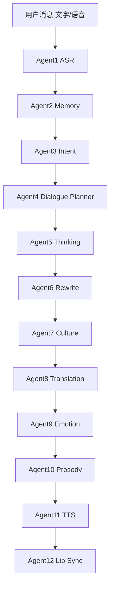

# AI Live OS v1.0 — 系统设计文档（chengjie 为底座）

> Universal AI Agent Operating System
> 状态：v1.0 蓝图（2026-07-24）。本文件是 Cursor 后续开发的单一事实源（SSOT）。
> 定位：不是"翻译软件"，是一套**共享 LLM + 多 Prompt 的 Agent 编排底座**，同一底层驱动
> AI 陪伴聊天 / 数字人直播 / 客服 / 翻译 / 主播。**不追实时，追真人感。**

---

## 0. 核心洞察（先读这条）

真人感的构成大约是 **表达层 80% + 音频层 20%**：

- **表达层**＝说什么、怎么组织语言、何时停顿/思考/口误/强调/分条。由 Rewrite / Thinking /
  Dialogue Planner 三个 Agent 决定。这是"不像 AI"的决定性因素。
- **音频层**＝音色保真、采样率、韵律方差。由 Emotion / Prosody / TTS 决定，是天花板但不是地板。

**我们相对实时直播产品的降维优势**：ChatGPT-5.6 那套架构（100ms ASR、token streaming TTS、
异步流水线）一半复杂度是为**实时**付的税。我们的聊天陪伴/异步语音**不需要实时**，因此可以把
算力全砸在**表达质量**上——多轮 LLM（生成→自评→改写）、best-of 重 roll、更大模型、更长思考。
非实时 = 可以慢工出真人感。

---

## 1. 设计原则（对齐 Cursor 系统提示词 9 条）

1. 所有模块解耦，纯函数核心 + 配置门控（沿用现有 chengjie 风格）。
2. 每个 Agent 可独立升级，互不阻塞。
3. 所有模型热插拔（backend 配置切换，非硬编码）。
4. **Agent 优先于加模型**：能力靠不同 Prompt 承载。
5. **一个共享 LLM + 多 Prompt**：表达层共用 173 `qwen3:30b-a3b`；主对话共用 DeepSeek（云）。
6. Streaming 仅在直播态启用；聊天态分块（split-send）即可，不强求 token 流。
7. Agent 异步并行（现有 `async` TTS/生成链已具备）。
8. 所有 Agent 暴露稳定接口（纯函数签名 + config 键），便于替换。
9. 工作流切换 = 切 Agent 配置（chat / live / cs 三态共用底座）。
10. 三大指标：**真人感 Humanity > 稳定性 Stability > 实时性 Latency**（我们对实时让位）。

---

## 2. 架构总览



一次"真人感"发声的实际数据流（chengjie 现状）：

```mermaid
flowchart LR
  GEN["主 LLM 生成回复<br/>DeepSeek + 人设/记忆"] --> SV["spoken_variant<br/>同调产口语版 Phase G"]
  SV --> SEND["发送时取口语版<br/>take_spoken_variant"]
  SEND --> SYN["TTSPipeline.synthesize"]
  SYN --> COL["colloquial 改写<br/>miss 时 173 兜底"]
  COL --> PAR["inject_paralinguistic<br/>叹气/气口/笑"]
  PAR --> SPD["cosyvoice_speed<br/>情绪变速"]
  SPD --> ENG["CosyVoice3 24k / Fish 44.1k"]
  ENG --> PARTS["pack_voice_parts<br/>分条连发 + 停顿"]
```



---

## 3. 12 个 Agent × chengjie 真实映射

图例：DONE=已建产线可用 / LIT=已具备刚点亮 / GAP=缺口需建 / LIVE=直播态（聊天陪伴不阻塞）

### Agent1 — Realtime ASR 【DONE】
- 实现：176 GPU（Whisper / FunASR / SenseVoice），`voice_recognition.fallback` 级联
  176 → 140 AvatarHub → 本机 CPU。
- 关键文件：`engines/chengjie/src/voice_transcriber.py`、`scripts/asr176/`。
- 边界：聊天态不需 100ms 流式；直播态 V2 再上流式。

### Agent2 — Memory 【DONE】
- 实现：`EpisodicMemoryStore`（关键词 + 向量融合召回）、`context_store`（会话上下文）、
  `memory_grounding`（防幻觉接地护栏）。
- 关键文件：`engines/chengjie/src/utils/context_store.py`、`src/ai/memory_grounding.py`。
- 接口：`get_bullets_for_prompt()`、记忆抽取 `extract_heuristic_facts` / `extract_memory_bullets`。

### Agent3 — Intent 【DONE】
- 实现：`analyze_emotion`（入站情绪/维度/唤醒度）、skill_manager 意图路由、trigger 词表。
- 关键文件：`engines/chengjie/src/utils/emotional_context.py`、`src/skills/skill_manager.py`。
- 接口：`analyze_emotion(text) -> {primary_emotion, primary_intensity, dimension, valence, arousal}`。

### Agent4 — Dialogue Planner 【GAP，核心缺口】
- 现状：节奏逻辑**散在三处**，没有统一规划器：
  - 延迟模型 `src/inbox/humanize.py`（`estimate_thinking_delay` / `resolve_pacing`）
  - 语音分条 `telegram.voice_reply.split_send`（`pack_voice_parts` @ `src/ai/voice_clone_client.py`）
  - 停顿/强调 `src/ai/voice_emotion.py`（`inject_paralinguistic`）
- 目标（Stage 2）：新建 `src/ai/dialogue_planner.py`，把上述三者收敛为一个 Agent，
  输出一份**表演脚本**（PerformanceScript）：分几条、每条停顿时长、哪个词强调、要不要笑、
  要不要重复。纯函数 + 配置门控，供 TTS/发送链消费。这是"表达规划"落地点。

### Agent5 — Thinking 【LIT，需开+深化】
- 现状：
  - `humanize.estimate_thinking_delay`（按字长 + 唤醒度算思考/打字延迟，已有）
  - `disfluency`（口误自纠）在 `voice_colloquial_llm` / `spoken_variant`，**默认关**
- 目标：开 `avatar_voice.colloquial.disfluency: true`（确定性 crc%7 低频，防做作）；
  生成层注入思考气口（"嗯……让我想想……"）。停顿由 Dialogue Planner 按句长/复杂度决定，非随机。

### Agent6 — Rewrite 【LIT，需加力度】
- 现状（三层）：
  - **Phase G 生成层**：`src/ai/spoken_variant.py`——主 LLM 一次调用同产书面版 + 口语版
    （`[口语版]` 标记，哈希暂存跨"生成→发送"）。**默认 `generated: false`（没开！）**
  - **A 档 TTS 时改写**：`src/ai/voice_colloquial_llm.py`——173 本地模型 `rewrite_local`
    深度口语化（LRU 缓存 + 60s 熔断 + 输出消毒）。
  - **P0 规则档**：`src/ai/voice_colloquial.py`——零延迟确定性换词兜底。
- 缺陷：现有 prompt 硬性"绝对不能增加新信息" → 只做"因此→所以"级换词，达不到主播味。
- 目标（Stage 1）：增加可调 `rewrite_intensity: light | natural | vivid`——
  vivid 档允许加语气/口头禅/停顿/主观框架（"说真的/我个人觉得"），**但严禁编造事实**
  （数字/时间/人名/金额/承诺不可变，沿用现有事实锚 + 危机文案哈希失配回落）。

### Agent7 — Culture 【LIVE，聊天弱需求】
- 现状：语言路由 `translation.engines.per_lang_order`、语言守卫、按会话语种取配文。
- 目标（Stage 4）：Language Pack（国家文化/口语/主播风格/流行语/禁忌词/商品术语），
  直播翻译态用；聊天陪伴态优先级低。

### Agent8 — Translation 【DONE】
- 实现：`translation.engines`（hy-mt2-7b LAN + DeepSeek 云 + 确定性引擎），意译 + 语义闸门
  + 置信度切换 + per-lang 覆写。
- 关键文件：`src/ai/translation_confidence.py`、`config/eval/translation_samples_hymt.yaml`。

### Agent9 — Emotion 【LIT，刚开】
- 实现：`derive_emotion` → `EmotionSpec{emotion, intensity, pace}`（10 标签），
  `resolve_emotion_for_send`（门控 `voice_cfg.emotion.enabled`）。
- 关键文件：`src/ai/voice_emotion.py`、`src/ai/persona_voice.py`。
- 现状：`telegram.voice_reply.emotion.enabled: true` + `emotion_channel_threshold: 0.5` 已上线。

### Agent10 — Prosody 【LIT，刚开】
- 实现：`cosyvoice_speed`（情绪变速表 0.90–1.12）、`inject_paralinguistic`
  （`[sigh]`/`[breath]`/`[laughter]`/`<strong>`）、`avatar_voice.prosody.flow_temperature`
  （CFM flow 方差，服务端 payload）。
- 关键文件：`src/ai/voice_emotion.py`、`src/ai/avatar_voice.py`。

### Agent11 — Streaming TTS 【DONE（分块态）】
- 实现：`TTSPipeline.synthesize`（clean → emotion → prerender → cache → 后端派发 → RVC/环境音）；
  后端：`avatar_clone`(CosyVoice3 24k) / `hub_fish`(Fish 44.1k) / `minicpm_clone` / `edge_tts` 等。
  分条连发 `pack_voice_parts` + `_voice_recording_gap`。
- 关键文件：`src/ai/tts_pipeline.py`、`src/client/sender.py`。
- 边界：聊天态分块即可；直播态 V2 上 token streaming。

### Agent12 — Lip Sync 【LIVE】
- 实现：AvatarHub（176:9000）+ faceX/幻影 LiveX 数字人口型。
- 边界：直播/口播应用；聊天陪伴不阻塞。

---

## 4. 真人感差距结论

| Agent | 状态 | 差距 |
|---|---|---|
| 2/3/8/11 | DONE | 无 |
| 9/10 | LIT | 已上线，随 Agent6 联动 |
| **6 Rewrite** | LIT | **力度不足 + Phase G 没开**（最大单点收益） |
| **5 Thinking** | LIT | disfluency 关、无思考气口 |
| **4 Dialogue Planner** | GAP | **完全缺失**（表达规划统一器） |
| 7 Culture / 12 Lip Sync | LIVE | 直播态，聊天不阻塞 |

**首个打磨目标：lin_xiaoyu 聊天陪伴**（有参考音 + 逐字稿 + 主力语音流量，基础最好）。

---

## 5. 关键 Prompt 模板（Agent6 Rewrite）

### 5.1 陪伴态口语重塑（vivid 档，TTS 时 / 生成层通用语义）

```
你是"把 AI 写的回复变成真人会怎么说"的口语重塑助手。目标：听起来像一个真实的人在
微信语音里随口说，而不是念稿。

必须遵守（红线，违反即失败）：
1. 事实不可变：数字、时间、日期、金额、人名、地名、任何承诺，值和含义一律原样保留。
2. 不编造：不得凭空加入原文没有的具体事实（可以加语气/口头禅/口语连接，但不加"信息"）。
3. 同一种语言，不串语言。

请这样重塑：
- 拆开生硬长句，用日常口语词（因此→所以、是否→是不是、非常→特别）。
- 允许加一点点主观口吻框架（"说真的""我跟你讲""其实我觉得"），但别每句都加。
- 语气：{tone}；说话风格：{style}。
- 可以有轻微的语气词和自然停顿感，像真的在想着说。

只输出重塑后的那段话本身，不要引号、不要解释、不要任何前后缀。
```

`rewrite_intensity` 三档差异：
- `light`：仅换词 + 拆句（≈ 现有行为，最保守，事实零风险）。
- `natural`：+ 句首口语连接 + 语气词（当前生产默认）。
- `vivid`：+ 主观口吻框架 + 停顿感（主播味/陪伴感最强，红线不变）。

### 5.2 生成层口语版指令（Phase G，附加在主 LLM prompt 末尾）

```
【语音版输出——本条回复将以语音条发送】
正常写完回复后，另起一行，以 [口语版] 开头，再写一遍这条回复的"说出来"版本：
意思和所有事实不变，改成像微信语音那样自然口语——短句、顺口、可带轻微语气词，
去掉书面连接词/列表符号/括号注释，可以有一点点"真人随口说"的主观口吻。
与正文同一种语言。除正文和这一行外不要输出任何解释。
```

（Phase G 由主对话 LLM = DeepSeek 产出，手握完整人设/记忆/上下文，质量高于事后改写，
且省一次本地 LLM 往返。哈希失配自动回落 A 档/规则档，危机文案绝不被顶替。）

---

## 6. 分阶段里程碑

| Stage | 内容 | 改动面 | 重启 |
|---|---|---|---|
| Doc | 本文件 | docs/ | 否 |
| 1 | Rewrite vivid 档 prompt + 开 Phase G generated + disfluency | `voice_colloquial_llm.py` / `spoken_variant.py` / overlay | 是（.py） |
| 2 | 新建 `dialogue_planner.py`（表演脚本）+ 开 split_send | 新模块 + overlay | 是 |
| 3 | hub Fish 用真参考音重注册声纹档 → 44.1kHz + 身份正确 | 176 hub 运维 + overlay | 否（overlay） |
| 4 | 方法论复制其余人设 + Culture Pack + Lip Sync 直播态 | 多模块 | 分批 |

---

## 7. 主机分工

| 机 | 角色 | 承载 Agent |
|---|---|---|
| 176（5090 32G） | 音频保真主力 + ASR/SER + 视觉 + 翻译 | 1, 8, 10, 11(Fish 44.1k), 12 |
| 173（5090 32G） | 表达层 LLM 主机（共享 qwen3:30b） | 5, 6(TTS 时改写兜底) |
| 云 DeepSeek | 主对话 + 生成层口语版 | 6(Phase G) |
| 117（chengjie） | Agent 编排底座 + 全部纯函数逻辑 | 2, 3, 4, 9 编排 |

---

## 8. 验收与回滚

- 每阶段真机 A/B（BASE 关档 vs 新档），试听包落 `tmp_voice_ab/`。
- 指标：`avatar_voice_stats`（`colloquial_llm` / `colloquial_gen` / `paralinguistic` 计数）
  → `/api/voice/avatar-status` + ops 卡。
- 客观分：AvatarHub `/api/clone_score`（campplus 声纹 cosine + prosody 自然度）。
- **全部走 `config.local.yaml` overlay，可秒回滚**；prompt 改动经唯一入口重启：
  `deploy/instances/restart_instance.ps1 -Instance zhiliao`（攒批）。

---

## 9. 风险与边界

- vivid 档"过度演绎/编造"风险 → 事实锚（数字/承诺/危机文案）不可改，`spoken_variant`
  哈希失配自动回落既有安全链（`persona_guard` / crisis safety net 优先级最高）。
- 173 qwen3 改写质量若不足 vivid → Phase G 用 DeepSeek 兜主力，173 仅 TTS 时兜底。
- 生产双实例（智聊 18799 / 通译 18899）：只动一台、机器级 10min 冷却、脏树闸门，
  见 `.cursor/rules/chengjie-dual-instance-ops.mdc`。

---

## 10. Stage 3 客观验收实测（2026-07-24，数据裁决）

**结论：数据否决"切 hub_fish"路径，聊天语音固定 CosyVoice3 = 身份 + 自然度双赢。**

方法（非破坏性）：在 AvatarHub（176:9000）创建独立 profile `chengjie_lin_xiaoyu`，参考音 =
chengjie 真 `lin_xiaoyu.wav`（**不覆盖** hub 既有 `lin_xiaoyu` 数字人档，避免污染直播侧）。
经 `/api/engine_ab_compare` 让 Fish-Speech(44.1k) vs CosyVoice 各自以该真参考音克隆同句，
campplus 声纹 cosine + prosody 自然度打分。脚本 `tmp_voice_ab/stage3_hub_verify.py`，
音频落 `tmp_voice_ab/stage3_*.wav`，分数 `tmp_voice_ab/stage3_scores.json`。

| 引擎 | cosine（身份保真） | naturalness（自然度） | winner |
|---|---|---|---|
| **CosyVoice 24k** | **0.63 / 0.60** | **0.96 / 0.82** | ✅ 两句全胜 |
| Fish-Speech 44.1k | 0.31 / 0.32 | 0.86 / 0.83 | — |

关键读数：
- **排除"参考音坏"假设**：即便喂 chengjie 真参考音，Fish 身份仅 ~0.31，CosyVoice ~0.63
  （≈2×）。此前 hub_fish cosine 0.17 不只是参考音错，是 Fish 对该音色本身克隆力弱。
- **44.1kHz ≠ 身份更像**：高采样率没换来更高声纹相似度；CosyVoice 24k 身份 + 自然度双高。
- **切 hub_fish 的代价 = 身份腰斩(0.63→0.31) + 丢全套活人感**（colloquial/paralinguistic/
  emotion/prosody 都在 CosyVoice 路径）。故**生产维持 CosyVoice3 + 活人感栈不变**。

hub_fish flip 的前置条件（若将来仍要上）：① 把表达层移植到 hub 合成路径；② Fish 声纹
克隆力提升到 cosine ≥ CosyVoice。两者未满足前，`inbox.l2_autosend.voice` / `telegram.voice_reply`
的 backend 保持 `avatar_clone`（CosyVoice3），`hub_fish` 仅留作直播态/口播的 44.1k 备选。

---

## 11. Stage 4 全人设复制 —— 引擎选择随声纹身份而变（2026-07-24）

**结论：Stage 1–2 活人感栈已是全局配置（对所有人设生效），Stage 4 复制 = 逐声纹身份客观验收。**

chengjie 7 个聊天人设实际共用 **2 个声纹身份**（`profiles_runtime.yaml`：多数指向
`lin_xiaoyu.wav`，其余指向 `liu_dehua_ref.wav`）。同法 `/api/engine_ab_compare` 逐一验收：

| 声纹 | CosyVoice cosine | Fish cosine | winner | 采纳 |
|---|---|---|---|---|
| `lin_xiaoyu`（主力女声） | **0.65 / 0.63** | 0.31 / 0.32 | CosyVoice 两句全胜（≈2×） | CosyVoice3 |
| `liu_dehua`（男声） | 0.51 / 0.57 | 0.70 / 0.51 | 平手（Fish 句0 更高 0.70） | CosyVoice3 |

读数：
- **引擎最优随音色而变**：Fish 对 `lin_xiaoyu` 女声克隆力弱（0.31），对 `liu_dehua` 男声反而
  有身份优势（句0 0.70）。不存在"一个引擎通吃"。
- **主力人设 = lin_xiaoyu**（主要语音流量）→ CosyVoice 决定性胜出 + 全套活人感，全局采用
  CosyVoice3 是正确取舍。`liu_dehua` 上 Fish 的边际身份收益 < 丢活人感的代价。
- **未来**：若某"纯口播/直播"男声产品把裸身份保真置于活人感之上，可对 `liu_dehua` 做
  **人设级 backend 覆写**上 Fish——属直播态决策，聊天陪伴态不触发。

Agent7 Culture Pack / Agent12 Lip Sync 属**直播态**（用户明确"视频配音先不做、聊天语音先做
到最佳"）→ 本轮不落地，待直播应用启动时接 AvatarHub（176:9000 已有 `musetalk`/`ditto` 口型 +
`faceswap`，接口就绪）。

副产物（非破坏性）：hub 新增 `chengjie_lin_xiaoyu` / `chengjie_liu_dehua` 两个**仅带 voice_b64**
的 profile（真参考音、身份正确），不干扰 hub 既有同名数字人档；将来任何 hub_fish flip 直接指向
它们即身份正确。
