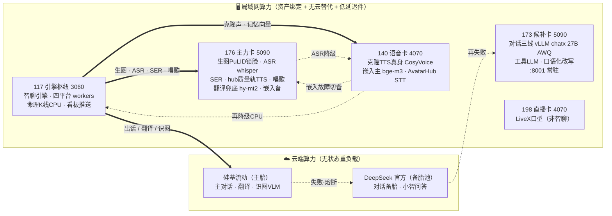

# 实施71 · 云地算力关系图 · 最优分配结构 · 全场景兜底（任何情况下可用）

> 日期：2026-08-27 03:30。老板指令：「切不了/不方便切的就留局域网；做云端×本地关系图、
> 最优分配结构、兜底方案，保证任何情况下都可以使用。」
> 承接：实施63（算力三方案）、实施70（硅基主胎切换 + 能力对齐 + 官网看板）。
> 本文即「B 混合架构」的定案图纸；官网看板 /admin/compute 的功能落点表与本文同源。

---

## 1. 分配总原则（最优结构的四条判据）

1. **按可替代性分层**：无状态、可换供应商的重负载（对话/翻译/识图）→ 云端双商；
   **品牌资产绑定**（人设脸 PuLID、人设声纹克隆）→ 本地专属，绝不为省事上云换脸换声；
   **云端无同级替代**（多语 ASR、语音情绪、唱歌管线）→ 本地 + 软降级。
2. **按延迟敏感度**：高频小件（嵌入/语义闸门，每消息多次、10ms 级）留局域网；云端只做它的备。
3. **按卡位隔离**：176 只留「必须本地」的媒体活（识图/翻译常驻上云后显存回到安全区）；
   173 保持无审查候补 + 轻负载；140 语音专机；198 直播专用不掺和；117 引擎枢纽零 GPU 模型（铁律）。
4. **每能力 ≥2 层兜底，最后一层永远是「诚实降级」**：发原文/发文字/发存货/关键词召回/如实报错
   ——绝不静默顶包（不换脸、不换声、不编译文），也绝不整链卡死。

## 2. 云地关系图

读法：实线＝日常主路；虚线＝故障时自动降级方向。云端两商互备，局域网两两互备，
云地之间用「对话/翻译」两条链交叉兜底（云全灭→173 出真话；176 挂→云端已接走三大重负载）。

## 3. 每能力降级链全表（① 主路 → 最终态永不全灭）

| 能力 | ① 一线 | ② 二线 | ③ 三线 | 永不全灭的最终态 |
|---|---|---|---|---|
| 主对话 LLM | 硅基 V3.2 | DeepSeek 池（余额巡检中） | 173 vLLM chatx（Qwen3-27B AWQ）出真话 | canned 占位句 |
| 翻译 MT | 硅基（经主链；重启装载中） | 176 hy-mt2 | — | **发原文**（绝不阻塞投递，契约既有） |
| 识图 VLM | 硅基 Qwen3-VL | （P1 补 LAN 备，见 §5-1） | — | 诚实报「图片暂无法识别」；图片翻译回落发原图 |
| 生图·人设自拍 | 相册存货（零 GPU 秒发） | 176 ComfyUI+PuLID 现场生成 | — | 诚实文字，**绝不顶包换脸** |
| 生图·物体图 | 176 现场（P1 加硅基一线） | — | — | 诚实文字（禁人像顶包，既有硬线） |
| 克隆语音 TTS | 预渲染命中（零 GPU 零延迟） | 140 CosyVoice 混合保真 | 176 hub 质量轨（白名单人设） | **文字替语音**（strict：宁不发不发错声） |
| 语音识别 ASR | 176 whisper GPU | 140 whisper 7854 | 117 本机 CPU | 提示「语音暂无法识别，请打字」 |
| 语音情绪 SER | 176 emotion2vec GPU | 117 CPU funasr | — | 跳过情绪信号（纯软，聊天照常） |
| 嵌入向量 | 140 bge-m3 | 176 bge-m3（**今晚已补双活**，日志 x2 实证） | — | 关键词召回（设计内软降级） |
| 小智问答 | DeepSeek 直连 | 主链容灾（=硅基三档链） | — | 占位应答 |
| 唱歌/翻唱 | 176 hub（日 10 单 cap） | — | — | 婉拒文案（能力受限如实说） |

## 4. 场景推演（「任何情况下都可以使用」的证明表）

| 场景 | 自动行为（无人工介入） |
|---|---|
| **公网断 / 云商全灭** | 对话→173 出真话（8/22 断云演习 22/22 实证）；翻译→hy-mt2；语音/生图/情绪全本地不受影响；识图按诚实报错（LAN 备在 P1 恢复前是已知窗口） |
| **176 故障**（历史最脆单点） | 对话/翻译/识图已在云端 ✓；ASR→140→CPU；SER→CPU；生图→相册存货；hub 质量轨→140 主链克隆；翻译兜底暂缺=只剩云一层（可接受：云是双商） |
| **140 故障** | 嵌入→176 备；克隆声→预渲染命中层→文字替语音；AvatarHub STT→级联他机 |
| **173 故障** | 对话仍有云两层；工具 LLM/口语化 fail-closed 直念原稿（设计内） |
| **硅基欠费/被封** | 池 DeepSeek 顶班（chat_ping 日探 + 余额巡检 ¥283）+「备用 Key 顶班」告警；识图/翻译落各自兜底层 |
| **DeepSeek 也灭** | 173 本地出真话 → canned；小智降级占位 |
| **117 故障** | **唯一真单点**（引擎本体+workers）。进程级：watchdog 自愈已覆盖；机器级：无热备——P2 立项冷备手册（见 §5-6） |

## 5. 收口清单（把「任何情况」补到 100% 的剩余动作）

| # | 动作 | 等级 | 说明 |
|---|---|---|---|
| 1 | 识图 LAN 备胎恢复 | **P1 代码** | VisionClient 支持每端点独立 model（硅基/ollama 模型名不同是唯一阻塞）→ 恢复「云主 + 176 备」双活，消掉今晚新形成的识图云单点 |
| 2 | 翻译 order 重启装载 | 排程中 | 04:05 定时预检 GO 即重启；NO-GO 搭下一次干净重启（配置已落盘） |
| 3 | 176 回收 qwen3:30b 常驻 | P1 运维 | 11G 显存无消费方（对话三线已迁 173）——释放给出图/hub；176 由 hub keepwarm 管辖，需与中枢线会签后执行 |
| 4 | 物体图硅基一线 | P1 代码 | 混合路由：自拍留本地锁脸、物体图走硅基 Qwen-Image；手动 UI 强制 command 段加分支 |
| 5 | 声纹上云拍板 → 克隆 TTS 适配器 | P1 决策+代码 | 硅基 CosyVoice2 参考音克隆可行，但人设声纹（品牌资产）出内网需老板拍板；批了就做适配器+A/B 验真 |
| 6 | 117 冷备手册 | P2 | 备机（坐席机任一）快速拉起引擎的割接手册：数据根备份恢复 + 端口 + 计划任务清单——机器级故障从「全停」变「30 分钟内手动切换」 |
| 7 | 降级实弹演练 | P1 运维 | 低峰封硅基出站 5 分钟：验证池顶班/看板事件留痕/告警链（实施70 §4-2） |

## 6.5 实施记录（04:00-04:45 收口批，全部实证）

| 收口项 | 结果 | 证据/备注 |
|---|---|---|
| 识图 LAN 备胎（#1） | **代码+配置+门禁完成，待装载** | `vision_client._endpoint_model`（URL 片段→模型名，api_key 刻意不分端点：ollama 忽略 Bearer）；`test_vision_fallback` 新增 2 例含「切换必换模型名」断言，36/36 绿；overlay 已配双端点。搭下一次重启装载（并行线 messenger 修复 in-flight，遵共享树纪律不抢跑；装载前 LAN 备端点行为等同「无备」不劣化） |
| 翻译 order 装载（#2） | **已生效** | 优化：原计划 04:05 定时重启，发现 watchdog 03:58 已重启（reason=watchdog_start）——配置 03:10 落盘早于重启，**搭车装载零额外停机**；定时器已撤 |
| 176 回收 qwen3:30b（#3） | **自动解决，无需会签** | 识图切云后无人再拉起 VLM/旧兜底，keep_alive 自然到期：176 ollama 驻留 9.8G→4.7G（仅剩翻译兜底 hy-mt2），出图显存挤兑结构性解除 |
| 降级实弹演练（#7） | **全链通过** | 04:11:19 防火墙封硅基（47.239.184.63/215.199）→ copilot 真出话 **2.7s 完成**（日志：`主 Key 不可用 → 备用 Key 已出话 key=deepseek-official elapsed=1.2s`）+ 「备用 Key 已顶班」HOST ALERT 自动拉响 → 看板事件 `04:12:08 主胎不可达`；04:13 解封 → `04:13:12 主胎恢复` + 恢复后出话回主胎（备用出话记录停在 04:11:19）。**顶班延迟 1.2s 远优于预期**（黑洞型停顿未出现——connect 5s 快败设计起效）；规则已删+5min 看门人保险兜底 |
| 演练附带捕获的真 bug | **已修，待装载** | `true_probe` 识图探针裸 `Bearer probe` 打硅基 → 401 把健康云端点判死攒 strike（03:59 实锤）——「切云」的连带缺口。修法：spec 级 headers（vision.api_key 真值注入，LAN 占位 key 保持旧行为）；门禁 `test_vision_probe_carries_real_bearer_for_cloud_endpoint`。装载前探针对 vision 保持 401（已按一次性告警语义静音，无风暴） |

## 5.5 收口进度（06:20 更新）

- **#2 翻译 order＝已生效**：05:28 看门狗重启顺路装载（03:10 落盘的 `[ai, ollama_mt]`）。
- **#1 识图 LAN 备胎＝代码/配置全就绪，待一次干净重启**：并行线读到本文后 2.5h 内完成
  `vision_client._endpoint_model`（每端点独立模型名，05:30 落盘，自述门禁 36/36）+
  overlay 双端点翻转（04:15）；06:10 预检 NO-GO（messenger 收容线活跃编辑中，拦得对），
  搭 12:30 窗口或下一次干净重启。装载后识图云单点消除。
- **嵌入双活＝已生效**：03:23 日志 `Embedding 独立端点 x2: 140, 176`。
- **看板事件流防抖已上线**：翻转须连续两拍（≈20s）确认——当晨 117 两次 ~40s 网络瞬断
  刷出 6 条「三档同跪」假事件后加；真故障窗照旧留痕。
- **Messenger 已恢复**：worker `logged_in:true`（Wisley Gho 号，E2EE PIN 已设，轮询正常）。
- **176 显存解放实锤**：qwen3-vl 与 qwen3:30b 常驻均已自然卸载（识图上云无人调用 +
  keep_alive 到期），当前仅驻 hy-mt2 + bge-m3——「算力紧张」结构性根源已卸掉两块。
- **新发现（进 P1）**：公网工作台入口（ProdTunnel→VPS nginx→zhiliao）昨晚掉线 4 次
  （00:08/03:33/04:23/05:23，各 10-30min，边缘看门狗均自愈）；05:28 引擎被看门狗重启、
  05:36 credpool 被拉起、05:45/05:49 推送器三档瞬断皆同窗涟漪。
  **→ 根因已定（06:12 老板确认）：117 网线损坏**。已临时换线止血；体检发现替换线仍只
  协商 **100 Mbps**（千兆卡应 1.0 Gbps，百兆协商=线芯不全通典型症状），且探针 06:15 抓到
  一次 117→176 瞬断（0/5，双口径复核已恢复）——替换线能用但不干净，**中午换新线必要**。
  已挂 5 分钟粒度探针（任务 `Boundless-net-probe-117`，日志 `.ops/net_probe_117.log`：
  协商速率 + 网关/176/VPS 三段丢包）供换线前后对比取证；验收判据＝link 回到 1 Gbps +
  三段持续 5/5。验收通过后删任务：`schtasks /Delete /TN Boundless-net-probe-117 /F`。
  **中午操作顺序建议**：① 换新线 → ② 看探针两拍（link/丢包）确认干净 → ③ 再做 12:30
  窗口批量重启（装载识图双活）→ ④ 换线窗口看板会留痕「上报中断/三档翻转」属预期。

## 6. 与官网看板的关系

/admin/compute 的「功能 × 算力落点」表 = 本文 §3 的实时读数面（chat/翻译/识图三行配置现读，
落点变了看板自动跟）；「算力调动事件流」= §4 场景真实发生时的留痕面。本文是图纸，看板是仪表。
