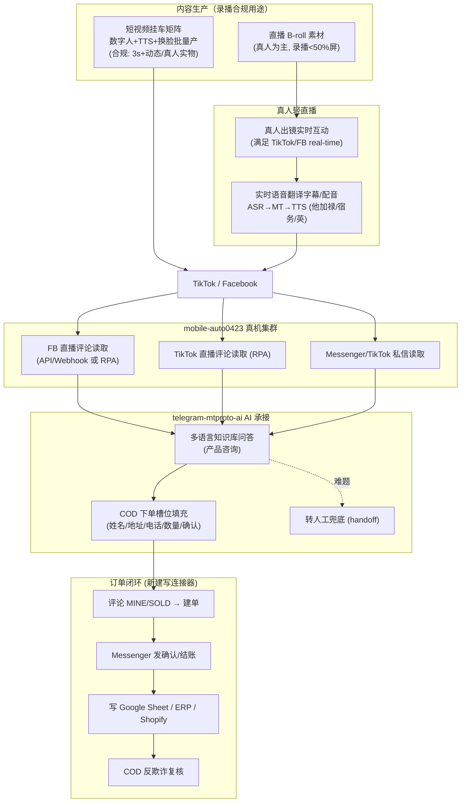

# 菲律宾直播电商 · 合规防封 + AI 承接 · 新方案（V2）

**日期**：2026-07-15
**客户场景**：菲律宾电商，在 TikTok + Facebook 直播销售，希望用「录播」方式做，并让 AI 承接产品咨询、聊天下单（COD 货到付款）、多账号矩阵（10+）、多语言（英/他加禄/宿务语）。
**性质**：本文件替代 V1（伪直播方案）。V1 的核心假设已被 2026-05 平台新规推翻，见 §1。

---

## 一、关键情报（2026 最新，决定方案生死）

### 1.1 TikTok Shop 新规：伪直播/AI 主播已被明令禁止（2026-05-23 生效）★

TikTok Shop US Academy《Requirements for High-Quality Videos and LIVEs》(2026-05-23) 明确规定，带货直播（promotional livestream）**禁止**：

- AI 生成语音、预录音频、电台式旁白（"Don't use non-real-time verbal interaction such as AI-generated voices, audio recordings, or radio"）
- 循环画面（looping footage）
- 静态图/截图/幻灯片占屏 **>50%**
- 非真人的动画形象（含 AI 数字人）占屏 **>50%**

**强制要求**：实时口语或手语互动、真人出镜（face-to-camera）、多角度实物展示、充足打光、稳定画面、字幕与口播同步。

**执行**：Creator Health Rating 积分制，违规累计 → 内容下架 → 佣金限制 → **封号**。

> **对我们的直接影响**：V1 里"把录播 MP4 当直播推 + AI 语音主播"这条路，在 TikTok Shop 是**明确违规、会封号**的。**必须放弃**。
> **但有一条生路**：新规禁止的是「AI 替代实时互动的主播」，**并不禁止 AI 作为幕后工具**——原文 "The ban applies specifically to AI standing in for real-time interaction during a live session, not to AI used before the camera goes on." 即：**AI 做评论/私信承接、做短视频素材、做翻译字幕，是允许的**。

### 1.2 Facebook Live 政策：同样禁循环/静态/误导实时

Meta《Facebook Live Policies》：不得用 Live 广播循环视频、静态图；不得误导观众"以为是实时而实际不是"；预录内容**必须明确标注 pre-recorded**。违规 → 降分发、限流、限制 Live 权限。

但菲律宾市场现实：
- Meta 已下线官方 "Live Shopping" 功能，当地 FB Live 带货**全靠评论→订单**（评论区刷 `MINE` / `SOLD` / `MINE 编号 数量`）。
- 主流第三方工具（BigSeller、MineBoss PH、EasyStore、Page365）都做同一件事：**实时扫评论关键词 → 自动建单 → Messenger 发结账/确认 → 库存同步**。付费方案 ₱3,990/年级别。
- 支付以 **COD 货到付款 + GCash / PayMaya** 为主。

> **对我们的直接影响**：FB 这边真正的刚需不是"伪直播"，而是**评论→订单的自动化 + Messenger COD 收单**。这正是我们能做、且做得比本地工具更强（多语言 AI + 客户画像 + 转人工）的地方。

### 1.3 多账号防关联：三层栈（2026 共识）

平台封的不是账号，是「setup」。三层缺一即死：

| 层 | 内容 | 我们的现状 |
|---|---|---|
| **网络层** | 一号一 IP、sticky、4G/5G 移动代理 >住宅代理 >>数据中心代理（后者已废）；时区/语言/GPS 必须与代理地一致 | ⚠️ 有 VPN 池但需换成**菲律宾移动代理** + 时区对齐 |
| **指纹层** | 每号独立设备指纹（canvas/WebGL/字体/GPU/传感器…50+ 项）且跨会话稳定 | ✅ **真机集群天然硬件指纹**，比 antidetect 浏览器更强（原文：跑真机/云机则 OS 层不需要 antidetect） |
| **行为层** | 新号 10–14 天养号、内容差异化、错峰、支付隔离 | ✅ 已有养号 `browse_feed`/warmup + 风控冷却，需补内容差异化 |

> **对我们的直接影响**：我们的真机集群 = 指纹层天然满分，这是相对"指纹浏览器矩阵"玩家的核心优势。缺口只在**网络层（换菲律宾移动代理 + 时区/GPS 对齐）**和**行为层的内容差异化**。

### 1.4 两项可复用的合规技术升级

- **实时 AI 语音翻译（成熟）**：级联管线 ASR→MT→TTS，广播场景延迟 2–5s 可接受，支持 100+ 语言，可克隆音色，接 RTMP/SRT/OBS。→ 真人主播用中文/英文讲，实时翻译成他加禄/宿务语**字幕+配音**，覆盖多语言市场。**这是合规的差异化卖点**（真人在播，AI 只做翻译）。
- **实时 AI 数字人（成熟但受限）**：LiveKit WebRTC + Tavus/HeyGen，sub-500ms，30+ 语言。但 EU AI Act（2026-08-02）要求合成媒体标注 AI，且 TikTok Shop 禁 AI 主播占屏>50%。→ **数字人只用于：短视频挂车、私信视频客服**，**不用于 TikTok Shop 直播主播**。

---

## 二、方案根本转向：从「AI 替人直播」→「真人轻直播 + AI 重承接」

V1（已废） vs V2（本方案）：

| 维度 | V1 伪直播（违规） | V2 合规承接（本方案） |
|---|---|---|
| 直播主体 | 录播 MP4 伪装直播 | **真人轻直播**（真人出镜互动，录播只作 B-roll/画中画，且 <50% 屏幕） |
| AI 角色 | AI 当主播（违规） | **AI 当幕后**：评论问答 + 私信 COD 收单 + 实时翻译字幕（合规） |
| 录播用途 | 主内容（违规） | **短视频挂车矩阵**（合规规模化）+ 直播辅助素材 |
| 规模化引擎 | 伪直播多开（封号） | 短视频矩阵 + AI 承接并发（不碰红线） |
| 差异化 | 无（人人都在做且被封） | 多语言 AI 实时翻译 + COD 智能收单 + 客户画像 |

**一句话**：直播这一环让真人做"合规的最小动作"（真人出镜、实时说话），把**规模、效率、24/7 全压到 AI 能合法承接的评论/私信/短视频三条线上**。

---

## 三、目标架构

---

## 四、现有资产映射（哪些直接用 / 改造 / 新建）

### ✅ 直接能用

| 能力 | 模块 | 用途 |
|---|---|---|
| 真机集群 + 天然硬件指纹 | `mobile-auto0423` multi_host / scrcpy | 防关联指纹层满分 |
| Messenger 私信 AI 回复 | `facebook.py::check_messenger_inbox` + `_ai_reply_and_send` | COD 私信承接 |
| TikTok 私信收发 | `tiktok.py::check_inbox` | TikTok 私信承接 |
| 养号 + 风控冷却 | `browse_feed` / warmup / `facebook_risk` / `tiktok_escalation` | 行为层 |
| 多语言翻译栈 | `translation_engines.py` / glossary / memory | 评论/私信多语言 + 实时字幕 |
| AI 大脑 + 知识库 | `skill_manager.py` + 四层触发 + bm25 KB | 产品咨询问答 |
| 数字人/TTS/换脸 | `avatar_voice.py` / `face_swap.py` / `tts_pipeline.py` / `index-tts` | **短视频挂车 + 私信视频客服**（不用于 Shop 直播主播） |
| 转人工 | contacts/handoff + 统一收件箱 | 难题 SLA 接管 |

### 🔧 改造能用

| 能力 | 模块 | 改造点 |
|---|---|---|
| 电商工具（只读） | `ecommerce_tools/` | 加 `create_order` **写连接器** + COD 落单表 |
| 订单/物流意图识别 | `ecommerce_tools/extract.py` | 加 `MINE/SOLD/+1/编号` 评论下单意图 |
| 别人直播间评论引流 | `tiktok.py::live_engage_session` | 复用选择器 → 改成**读自己直播间评论** |
| VPN 池 | `vpn_manager` | 换**菲律宾移动代理** + 时区/GPS 对齐 |
| 实时语音 | `realtime_voice.py`（MiniCPM-o 全双工） | 复用管线做**实时翻译字幕/配音**（或接 Palabra 类云 API） |

### ❌ 需新建（4 块）

1. **COD 聊天下单闭环**：评论 `MINE/SOLD` 关键词 → 建单 → Messenger 发确认 → 收集姓名/地址/电话/数量 → 写订单表。对标 BigSeller/MineBoss/Page365，但叠加多语言 AI + 客户画像。
2. **自有直播间评论实时读取**：FB 走 Graph API/Webhook（`facebook_webhook.py` 扩展）+ RPA 兜底；TikTok 走 RPA。
3. **实时语音翻译字幕/配音网关**：真人主播音频 → ASR→MT→TTS → 推回直播流（OBS 叠加字幕 / 多语言音轨）。
4. **菲律宾移动代理接入 + 时区/GPS 对齐 + 养号 SOP**：补齐防关联网络层。

---

## 五、防封号落地清单（三层栈 SOP）

### 网络层
- 每账号绑定**独立菲律宾 4G/5G 移动代理**（sticky，一号一 IP，绝不共用）。
- 设备时区 = `Asia/Manila`，语言 = English(PH)/Filipino，GPS 伪装到菲律宾城市，全部与代理地一致（不一致=秒标记）。
- 数据中心代理一律禁用。

### 指纹层
- 用真机/云机，硬件指纹天然唯一且稳定（**不要**每次登录随机化指纹——那是最快被标记的做法）。
- 封一台不复用其指纹/设备 ID 起新号。

### 行为层
- 新号 **10–14 天养号**：只做浏览/点赞/关注等"消费型"行为，之后才带货。
- **内容差异化**：矩阵号绝不发相同素材/相同话术/相同发布时间；短视频用不同 hook、不同 BGM、不同数字人形象。
- 支付/收款信息按号隔离。
- 直播遵守 §1 红线：真人实时出镜、录播素材 <50% 屏、无 AI 语音旁白、预录片段标注。

---

## 六、分阶段落地计划

### 阶段 0（W1）· FB 合规带货 MVP
- 真人轻直播 SOP + 评论实时读取（Graph API/Webhook）接进 AI 大脑。
- 多语言产品咨询问答跑通（复用 KB + 翻译栈）。
- 验收：真人直播中，AI 秒回评论（英/他加禄/宿务），合规无循环画面。

### 阶段 1（W2–W3）· COD 聊天下单闭环
- 新建 `MINE/SOLD` 评论建单意图 + `create_order` 写连接器 → 先落 **Google Sheet**（客户零门槛）。
- Messenger 收单槽位填充（姓名/地址/电话/数量/COD 确认）接 `_ai_reply_and_send`。
- COD 反欺诈复核（重复地址/异常号码标记）+ 转人工兜底。
- 验收：观众评论 `MINE 编号` → 自动私信确认 → 收全信息 → 生成订单号入表。

### 阶段 2（W4–W6）· 短视频挂车矩阵 + 多语言实时翻译
- 数字人 + TTS 批量产**合规短视频**（真人实物/动态镜头/3s+），矩阵化发布 + AI 承接评论私信。
- 实时语音翻译字幕/配音网关上线（真人中文/英文 → 他加禄/宿务字幕）。
- 菲律宾移动代理 + 时区对齐 + 养号 SOP 全量铺开。
- 验收：10+ 账号矩阵稳定运行，无级联封号；短视频→评论→私信→下单漏斗打通。

### 阶段 3（评估）· 规模化 + 数据闭环
- 曝光→评论→私信→下单→履约 漏斗看板。
- A/B：话术 / hook / 数字人形象 自动选优（复用 `ab_auto_graduate`）。
- 视客户接受度评估是否引入实时数字人私信视频客服。

---

## 七、风险与红线（务必对客户明示）

| 风险 | 说明 | 对策 |
|---|---|---|
| **TikTok Shop 直播红线** | AI 语音/录播/AI 主播带货 = 违规封号（2026-05-23 新规） | 直播必须真人实时出镜；AI 只做幕后承接/短视频 |
| **FB Live 误导实时** | 循环/静态/伪装实时 = 限流封号 | 真人直播；预录片段标注 pre-recorded |
| **矩阵级联封号** | 共用 IP/素材/时区不一致 = 批量封 | 三层栈 SOP（§5）严格执行 |
| **COD 拒收** | 菲律宾 COD 拒收率高（15–30%） | AI 收单叠加反欺诈复核 + 二次确认 |
| **合成媒体标注** | EU AI Act 2026-08-02 要求标注 AI（若涉欧盟受众） | 数字人内容加 AI 标识 |

---

## 八、与"无界"产品线的关系（顺带的商业机会）

这套「真人轻直播 + AI 重承接 + COD 收单」如果为客户跑通，可直接沉淀成**无界的一个可售 SKU**（对标 BigSeller/MineBoss/Page365 但更强）：

- 复用 **智聊 ChatX**（AI 承接）+ **通译 LingoX**（多语言）+ **智拓 ReachX**（真机矩阵）。
- 面向东南亚直播电商卖家，按坐席/GMV 抽佣计费。
- 差异化：多语言 AI + 客户画像 + 真机矩阵防封 + COD 智能收单，本地工具都不具备全栈。

> 即："给这个菲律宾客户做的定制"可升级为"无界的东南亚直播电商 SCRM 产品"，一鱼两吃。
